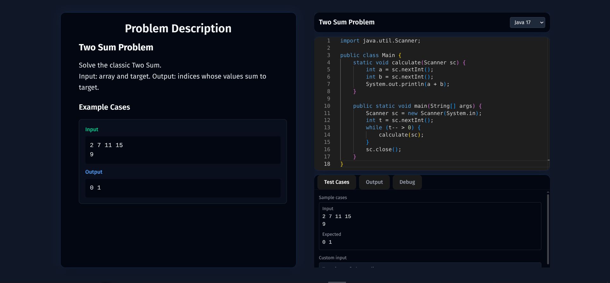

# ContestJudge Frontend


*Sample code for the Two Sum problem showing the interactive code editor and problem interface*

A modern React TypeScript frontend for the ContestJudge online programming contest platform. Provides an interactive code editor, problem solving interface, and real-time code execution capabilities.

## Overview

The frontend serves as the user interface for the ContestJudge system, allowing students and developers to:
- View programming problems with detailed descriptions
- Write and edit code in multiple programming languages
- Submit solutions and receive immediate feedback
- Test code with custom inputs before submission
- View execution results and debug information

## Architecture

### Technology Stack
- **Framework**: React 19 with TypeScript
- **Build Tool**: Vite 7 with Hot Module Replacement (HMR)
- **Styling**: Tailwind CSS with dark theme
- **Code Editor**: Monaco Editor (VS Code editor)
- **State Management**: TanStack React Query for server state
- **Routing**: React Router for client-side navigation
- **HTTP Client**: Axios for API communication
- **Development**: Mock Service Worker (MSW) for API mocking

### Key Components
- **ProblemPage**: Main interface for problem solving
- **CodeEditor**: Monaco-based code editor with syntax highlighting
- **LanguageSelect**: Multi-language support dropdown
- **ConsoleTabs**: Tabbed interface for test cases, output, and debugging
- **ResultPanel**: Execution results and error display

## Features

- **Multi-language Support**: Java, Python, C++ with syntax highlighting
- **Interactive Code Editor**: Professional Monaco editor with IntelliSense
- **Real-time Execution**: Submit code and receive immediate results
- **Custom Test Cases**: Input custom data to test code before submission
- **Responsive Design**: Works on desktop and mobile devices
- **Dark Theme**: Modern dark UI optimized for coding
- **Mock Development**: MSW integration for development without backend

## Development Setup

### Prerequisites
- Node.js 18 or higher
- npm or pnpm package manager

### Installation
```bash
npm install
```

### Development Server
```bash
npm run dev
```
Starts the development server on `http://localhost:5173`

### Build for Production
```bash
npm run build
```
Builds the app for production in the `dist` folder

### Linting
```bash
npm run lint
```
Runs ESLint to check code quality

### Preview Production Build
```bash
npm run preview
```
Serves the production build locally

## Backend Integration

### API Configuration
The frontend communicates with the Spring Boot backend through RESTful APIs:
- Base URL: Configured via `VITE_API_BASE_URL` environment variable
- Default: `http://localhost:8080` (Spring Boot default port)
- Timeout: 30 seconds for code execution requests

### CORS Configuration
Frontend runs on `localhost:5173` (Vite dev server) and communicates with backend on `localhost:8080`. Ensure CORS is properly configured in the backend to allow:
- Origin: `http://localhost:5173`
- Methods: GET, POST, PUT, DELETE, OPTIONS
- Headers: All headers allowed
- Credentials: Enabled for authentication

## API Endpoints

### Code Execution
- `POST /submit` - Submit code for final judging
- `POST /run-compare` - Run code with custom input for testing

### Problem Management
- `GET /problems/{id}` - Retrieve problem details and test cases

## Development Workflow

### With Mock Services (Recommended for Frontend Development)
```bash
# Frontend only development
npm run dev

# Uses MSW to mock API responses
# Perfect for UI/UX development without backend
```

### With Full Stack
```bash
# Terminal 1: Backend
cd ../backend
mvn spring-boot:run

# Terminal 2: Frontend
npm run dev

# Full integration testing
```

## Project Structure

```
frontend/
├── src/
│   ├── api/           # API client and endpoints
│   │   ├── client.ts     # Axios configuration
│   │   ├── submissions.ts # Code submission endpoints
│   │   └── runs.ts       # Code execution endpoints
│   ├── components/    # React components
│   │   ├── CodeEditor.tsx    # Monaco code editor
│   │   ├── LanguageSelect.tsx # Language dropdown
│   │   ├── ProblemPanel.tsx  # Problem description
│   │   └── ConsoleTabs/      # Tabbed console interface
│   ├── hooks/         # Custom React hooks
│   │   ├── useSubmitCode.ts  # Code submission hook
│   │   └── useRunCompare.ts  # Code execution hook
│   ├── pages/         # Page components
│   │   └── ProblemPage.tsx   # Main problem solving interface
│   ├── types/         # TypeScript type definitions
│   │   └── models.ts         # API response types
│   ├── constants/     # Application constants
│   │   └── templates.ts      # Code templates for each language
│   └── mocks/         # Mock service worker
│       ├── browser.ts        # MSW browser setup
│       └── handlers.ts       # API mock responses
├── public/            # Static assets
└── dist/             # Production build output
```

## Environment Variables

Create a `.env` file in the frontend directory:

```env
# Backend API URL
VITE_API_BASE_URL=http://localhost:8080

# Mock services (set to 'false' to use real backend)
VITE_USE_MOCKS=true

# Other environment variables...
```

## Browser Support

- Chrome 90+
- Firefox 88+
- Safari 14+
- Edge 90+

## Contributing

1. Follow the existing code style and TypeScript conventions
2. Use MSW mocks for new API endpoints during development
3. Test both with mocks and real backend integration
4. Update type definitions when adding new API responses
5. Follow the established component architecture

## Development Notes

- **Hot Module Replacement**: Enabled for fast development
- **TypeScript**: Strict mode enabled for type safety
- **Mock Services**: Automatically intercept API calls in development
- **Code Templates**: Pre-configured starter code for each supported language
- **Error Handling**: Comprehensive error states for network and execution failures

## Troubleshooting

### CORS Issues
- Ensure backend CORS configuration allows `localhost:5173`
- Check browser console for detailed error messages
- Verify backend is running on `localhost:8080`

### Mock Service Issues
- MSW might interfere with real API calls
- Set `VITE_USE_MOCKS=false` to disable mocks
- Check browser console for MSW errors

### Build Issues
- Clear `node_modules` and `dist` folder
- Run `npm install` to reinstall dependencies
- Check for TypeScript compilation errors

## Related Documentation

- **Backend README**: See main project README.md for backend setup
- **API Documentation**: Check curl_commands.txt for API testing examples
- **Architecture**: See Interview.md for technical decisions and integration details
